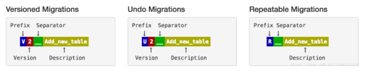

# Flyway

## Flyway是什么

Flyway是一款数据库迁移（migration）工具，约定大于配置。简单点说，就是在你部署应用的时候，帮你执行数据库脚本的工具。Flyway支持SQL和Java两种类型的脚本，你可以将脚本打包到应用程序中，在应用程序启动时，由Flyway来管理这些脚本的执行，这些脚本被Flyway称之为migration。

就目前而言，我们部署应用的流程大概是这样的：

- 开发人员将应用程序打包、按顺序汇总并整理数据库升级脚本
- DBA拿到数据库升级脚本检查、备份、执行，以完成数据库升级
- 应部署人员拿到应用部署包，备份、替换，以完成应用程序升级

引入Flyway之后的应用部署流程大概是这样的：

- 开发人员将应用程序打包
- 应部署人员拿到应用部署包，备份、替换，以完成应用程序升（Flyway将自动执行升级/备份脚本）

## 核心概念

### Migration

Flyway将每一个数据库脚本称之为：**migrations**，flyway支持三种类型的migration：

- Versioned migrations：最常用的migration，可以简单的理解为数据库升级脚本
- Undo migrations：数据库版本回退脚本，**需要Pro版本，忽略，而且使用过程存在较大风险**，undo操作目前只能通过plugin或者command-line来执行
- Repeatable migrations：可重复执行的migration，例如create or replace脚本，当脚本checksums改变时会重新执行

所有的migration都需要遵守命名规范：



## 使用

### Spring Boot自动配置

第一步：创建工程，build.gradle引入flyway的包

```groovy
buildscript {
    ext {
        springBootVersion = '2.2.1.RELEASE'
        springCloudVersion = 'Hoxton.RELEASE'
    }
    repositories {
        mavenCentral()
    }
    dependencies {
        classpath("org.springframework.boot:spring-boot-gradle-plugin:${springBootVersion}")
    }
}

apply plugin: 'java'
apply plugin: 'idea'
apply plugin: 'org.springframework.boot'
apply plugin: 'io.spring.dependency-management'

group = 'com.maji'
version = '1.0.0'

repositories {
    mavenCentral()
}

dependencyManagement {
    imports {
        mavenBom "org.springframework.cloud:spring-cloud-dependencies:${springCloudVersion}"
    }
}

dependencies {
    // spring web start
    compile('org.springframework.boot:spring-boot-starter-web')
    // jdbc
    compile('org.springframework.boot:spring-boot-starter-jdbc')
    // flyway
    compile('org.flywaydb:flyway-core')
    // mysql
    compile("mysql:mysql-connector-java:8.0.11")
    // lombok
    compile('org.projectlombok:lombok:1.18.2')
}
```

第二步：按Flyway的规范创建版本化的SQL脚本。

- 在工程的`src/main/resources`目录下创建`db`目录，在`db`目录下再创建`migration`目录
- 在`migration`目录下创建版本化的SQL脚本`V1_0_0__init.sql`

注意：如果你想将SQL脚本放到其他目录，可以在`application.yml` 中用`spring.flyway.locations`参数来配置，如

```yaml
spring:
  datasource:
    driver-class-name: com.mysql.cj.jdbc.Driver
    type: com.zaxxer.hikari.HikariDataSource
    jdbc-url: jdbc:mysql://127.0.0.1:3306/flyway?useUnicode=true&characterEncoding=UTF-8&allowMultiQueries=true&serverTimezone=Asia/Shanghai&useSSL=false
    username: flyway
    password: flyway
  flyway:
    locations: classpath:/mysql
```

到此完成，项目启动时就会执行`V1_0_0__init.sql`中的脚本。

打开本地数据库，我们发现 `V1_0_0__init.sql`中该创建的表都有了。同时还会生成张了 `flyway_schema_history` 表，该表主要是Flyway用来控制脚本是否执行的，执行过后，就会加一条记录。

有了这条记录，下次再启动 项目，`V1_0_0__init.sql`这个脚本就不会执行了，因为Flyway知道这个脚本已经执行过了，如果你还想让`V1_0_0__init.sql`脚本再执行一遍，需要手动删除 `flyway_schema_history` 表中的对应记录，那么项目启动时，这个脚本就会被执行了。

#### 重复执行脚本

我们在定义脚本的时候，除了 `V` 字开头的脚本之外，还有一种 `R` 字开头的脚本(上文中的Repeatable migrations)，`V` 字开头的脚本只会执行一次，而 `R` 字开头的脚本，只要脚本内容发生了变化，启动时候就会执行。

#### 配置

```yaml
spring:
  flyway: 
    enabled: true # 是否开启
    clean-disabled: true # 禁用数据库清理
    encoding: UTF-8
    locations: classpath:/db # sql目录
    #  flyway 会在库中创建此名称元数据表，用于记录所有版本演化和状态,同一个库不同项目可能冲突，可以每个项目一张表来记录
    table: flyway_schema_history_FlywayExample #TODO 值的后缀指定为当前项目名称
    baseline-version: 1 # 基线版本默认开始序号 默认为 1
    baseline-on-migrate: true #  针对非空数据库是否默认调用基线版本,为空的话默认会调用基线版本
    placeholders: # 定义 afterMigrateError.sql 要清理的元数据表表名
      flyway-table: ${spring.flyway.table}
```

### 提高Flyway Configuration执行优先级

正常集成存在一个问题，如果其他Configuration类用到了数据库，但是数据库中的表时通过Flyway配置的，会导致其他Configuration中无法获取到表。

在遇到需要先加载数据方面的操作，都需要在flyway执行完毕后才能加载，不然会出现找不到新增的表或者修改的表结构、新增表数据。

#### 弃用自动配置，手动配置Flyway

第一步：创建FlywayConfig类

```java
@Configuration
public class FlywayConfig {

    @Autowired
    private DataSource dataSource;

    @PostConstruct
    public void migrate() {
        Flyway flyway = Flyway.configure()
                .dataSource(dataSource)
                // 脚本目录
                .locations("flyway")
                .baselineOnMigrate(true)
                .load();
        flyway.migrate();
    }
}
```

第二步：启动类去除Flay自动配置

```java
@SpringBootApplication(exclude = {FlywayAutoConfiguration.class})
```

这样会导致application.properties中的`spring.flyway`配置都不起作用。

第三步：在需要的自定义配置类中加上注解：

```java
@ConditionalOnBean(FlywayConfig.class)
```

即可优先加载Flyway，执行脚本。