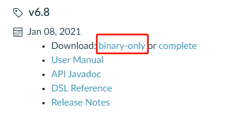
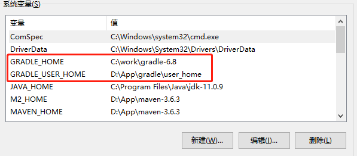
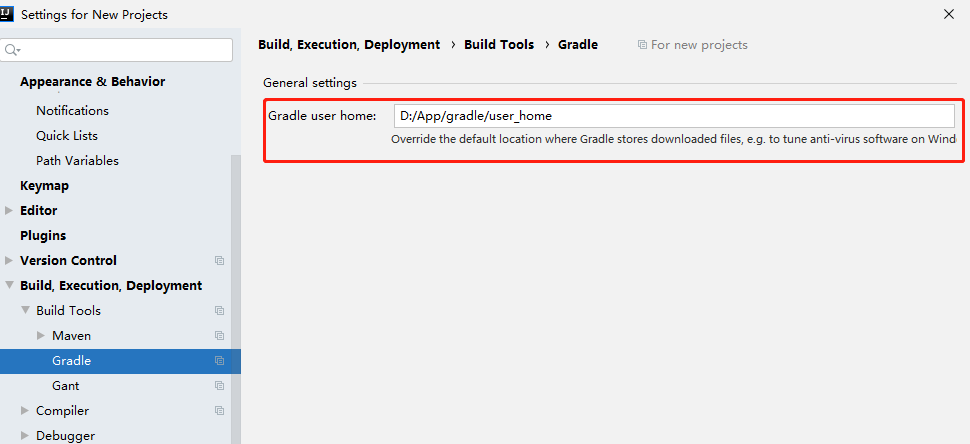
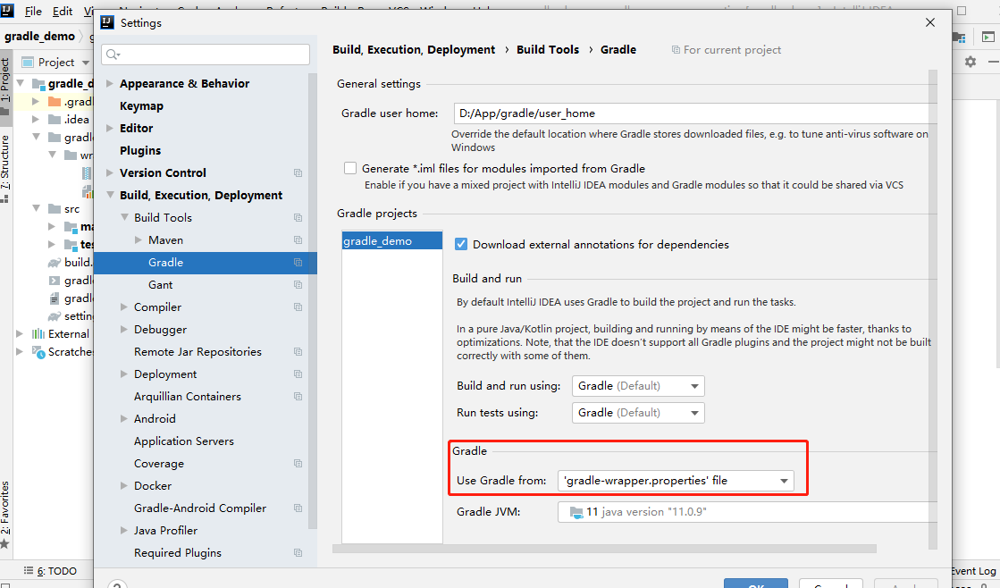
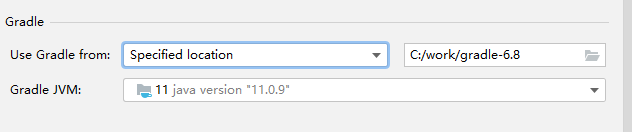
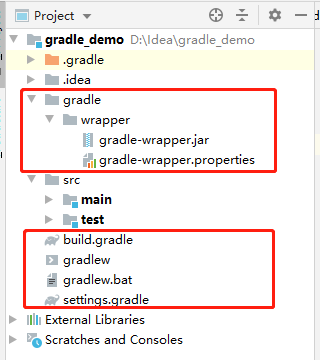
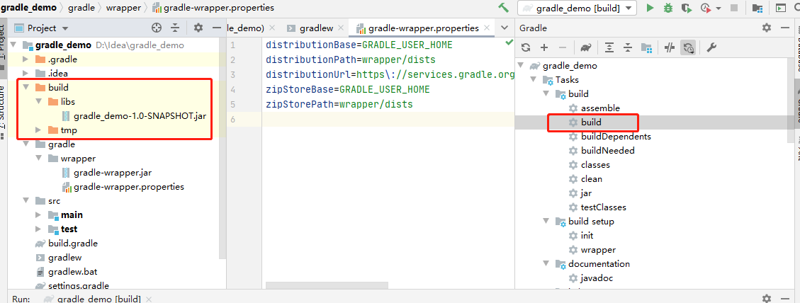

# Gradle

## 环境配置

前提：需安装Java，有 JAVA_HOME 环境配置

1、下载Gradle https://gradle.org/releases/  , binary-only 版本即可。



2、解压，配置 GRADLE_HOME 环境变量及 GRADLE_USER_HOME 环境变量，GRADLE_USER_HOME 可以理解成是 Maven 的 Repository 目录。



3、在path中新增一条 %GRADLE_HOME%\bin

## IDEA与Gradle

> 本人使用的IDEA版本为 2020.1.4
>
> 名词：Gradle中的项目，在Idea中可以理解为Module

通过Idea创建Gradle项目前，先配置下idea 的user home



Idea**创建**Gradle项目时，默认会用idea自带的gradle创建，而非我们下载的版本。可以参见 https://stackoverflow.com/questions/54708327/how-to-set-gradle-wrapper-version-when-create-new-project-for-intellij-idea



但是创建完，可以手动替换版本



创建完Gradle项目的目录为



- .gradle    gradle项目产生文件（自动编译工具产生的文件）。
- gradle     自动完成gradle环境支持文件夹。
- build.gradle     gradle 项目自动编译的配置文件。
- gradle.properties      gradle 运行环境配置文件，idea生成项目没有该文件。
- gradlew    自动完成 gradle 环境的linux mac 脚本，配合gradle 文件夹使用 代替gradle 命令实现自动完成gradle环境搭建,配合gradle文件夹的内容。
- gradlew.bat   自动完成 gradle 环境的windows 脚本，配合gradle 文件夹使用。
- setting.gradle gradle 项目的子项目包含文件。

进行build后，会生成 build文件夹



### gradlew与gradlew.bat 文件

上面两个文件会做如下几件事情：

1. 解析 gradle/wrapper/gradle-wrapper.properties 文件，获取项目需要的 gradle 版本下载地址
2. 判断本地用户目录下的 ./gradle 目录下是否存在该版本，不存在该版本，走第3点，存在走第4点
3. 下载 gradle-wrapper.properties 指定版本，并解压到用户目录的下 ./gradle 文件下
4. 利用 ./gradle 目录下对应的版本的 gradle 进行相应自动编译操作

### gradle-wrapper.properties 文件

```shell
distributionBase=GRADLE_USER_HOME
distributionPath=wrapper/dists
distributionUrl=https\://services.gradle.org/distributions/gradle-6.1.1-bin.zip
zipStoreBase=GRADLE_USER_HOME
zipStorePath=wrapper/dists
```

主要关心 **distributionUrl** 这个属性，可以用指定本地的版本，导入一个gradle项目，默认这个文件中的版本去构建。

### settings.gradle 文件

settings.gradle 文件包含必要的一些设置，例如，任务或项目之间的依懒关系等。

```shell
# settings.gradles是模块Module配置文件，大多数setting.gradle的作用是为了配置子模块， 根目录下的setting.gradle脚本文件是针对module的全局配置 

# settings.gradle用于创建多Project的Gradle项目。Project在IDEA里对应Module模块。 

# 例如配置module名rootProject.name = 'project-root',为指定父模块的名称， include 'project-core' 为指定包含哪些子模块
```

示例：

```shell
//平台根
rootProject.name = 'project-root'
//包含子系统以及模块
include ':project-core'
//Hello系统模块的加载
include ':project-hello'
//World系统模块的加载
include ':project-world'
```

rootProject.name 类似pom.xml 的<artifactId>标签

include类似pom.xml的<modules>标签

### build.gradle 文件（作用类似于Maven中的pom.xml）

#### buildscript

buildscript中的声明是`gradle脚本自身需要使用的资源，为了Gradle脚本自身的执行，获取脚本依赖插件`。可以声明的资源包括依赖项、第三方插件、maven仓库地址等

```groovy
buildscript {
    ext {
        springBootVersion = '2.2.1.RELEASE'
        springCloudVersion = 'Hoxton.RELEASE'
    }
    repositories {
        maven { url "http://maven.aliyun.com/nexus/content/groups/public"}
        maven { url "https://repo.spring.io/milestone" }
        maven { url "http://jcenter.bintray.com" }
        mavenCentral()
        google()
        jcenter() //代码托管库：设置之后可以在项目中轻松引用jcenter上的开源项目
    }
    dependencies {
        classpath("org.springframework.boot:spring-boot-gradle-plugin:${springBootVersion}")
    }
}
```

#### ext

ext是自定义属性，可定义版本号，类似于pom.xml的<properties>标签。它不仅可以放在buildscript下，也可以把所有关于版本的信息都利用ext放在另一个自己新建的gradle文件中集中管理，使用方式：

1. 新建 version.gradle 文件

   ```groovy
   ext {
       springBootVersion = '2.2.1.RELEASE'
       springCloudVersion = 'Hoxton.RELEASE'
   }
   ```

2. 修改build.gradle文件

   ```groovy
   buildscript {
   
       apply from: 'version.gradle'
   //    ext {
   //        springBootVersion = '2.2.1.RELEASE'
   //        springCloudVersion = 'Hoxton.RELEASE'
   //    }
   }
   ```

#### repositories

即仓库，jcenter()、maven()和google() 就是托管第三方插件的平台。

#### dependencies

依赖，位于buildscript里的dependencies，需要用classpath配置需要的依赖，代表的是Gradle需要的插件。如`spring-boot-gradle-plugin`插件。

#### allprojects

语法和buildscript一致，和buildscript同级，主要是`为所有项目（Idea为Module）提供共同所需依赖包`，而子项目可以配置自己的repositories以获取自己独需的依赖包。

```groovy
allprojects {
    repositories {
        maven { url "http://maven.aliyun.com/nexus/content/groups/public"}
        mavenCentral()
    }
}
```

####  subprojects 

allprojects是对所有project的配置，`包括Root Project`。而subprojects是对所有Child Project的配置，不含Root。

**根级别**的repositories主要是为了`当前项目`提供所需依赖包，比如log4j、spring-core等依赖包可从mavenCentral仓库获得，私服加在根级别的repository才会把私服jar包下载下来。

**根级别的是指repositories、dependencies不在buildscript{}等srcipt里，在build.gradle文件中直接声明。**

#### apply plugin

```groovy
apply plugin: 'java'
apply plugin: 'idea'
apply plugin: 'org.springframework.boot'
apply plugin: 'io.spring.dependency-management'
```

apply plugin：'×××'，引入Gradle插件，而Gradle插件大致分为分为两种：

1. **apply plugin**：'×××'：叫做二进制插件，二进制插件一般都是被打包在一个jar里独立发布的，比如我们自定义的插件，再发布的时候我们也可以为其指定plugin id，这个plugin id最好是一个全限定名称，就像你的包名一样；
2. **apply from**：'×××'：叫做应用脚本插件，其实这不能算一个插件，它只是一个脚本。应用脚本插件，其实就是把这个脚本加载进来，和二进制插件不同的是它使用的是`from`关键字。后面紧跟的是一个脚本文件，可以是`本地`的，也可以是`网络存在`的，如果是网络上的话要使用HTTP URL。
   虽然它不是一个真正的插件，但是不能忽视它的作用。它是脚本文件模块化的基础，我们可以把庞大的脚本文件。进行分块、分段整理。拆分成一个个共用、职责分明的文件，然后使用apply from来引用它们。 

#### group  version

同pom.xml的<groupId>、<version>标签。

https://www.jianshu.com/p/8b8a550246bd

#### dependencyManagement

```groovy
dependencyManagement {
	imports {
		mavenBom "org.springframework.cloud:spring-cloud-dependencies:${springCloudVersion}"
	}
}
```

导入MavenBom，这个配置会将Spring框架的Bom的依赖应用到当前的项目。

#### compile

```groovy
dependencies {
    //指定本地jar包
    compile files('libs/picasso-2.4.0.jar')
    // 将libs目录下所有jar文件进行编译并打包
    compile fileTree(include: ['*.jar'],dir:'libs')
    // spring web start,用了dependencyManagement 这边就不用版本号了
    compile('org.springframework.boot:spring-boot-starter-web')
    // mysql
    compile("mysql:mysql-connector-java:8.0.11")
    implementation 'junit:junit:4.12'
    compileOnly 'org.projectlombok:lombok:1.18.14'
	testCompileOnly 'org.projectlombok:lombok:1.18.14'
}
```

dependencies 中的 compile，copileOnly，类似于pom.xml中的<scope>标签，除了以上，还有provided等。

`compile`指编译范围依赖在所有的classpath 中可用，同时它们也会被打包，而且这些dependency会传递到依赖的项目中。

`provided`是指编译的时候依赖这个jar包，但是最终打包的时候不打进去。和`compileOnly`效果一样。

注意：在Android Studio 中，compile被取代了，`api`和`compile`是一样的效果，`implementation`有所不同，通过`implementation`依赖的库只能自己库本身访问，举个例子，A依赖B，B依赖C，如果B依赖C是使用的`implementation`依赖，那么在A中是访问不到C中的方法的，如果需要访问，请使用`api`依赖。

