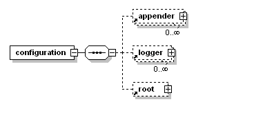

# Logback

Springboot 自带logback jar包，在resources下面创建 `logback-spring.xml`，带spring后缀的可以使用<springProfile>这个标签。

## 配置详解

主要的结构：



### 根节点configuration

包含下面三个属性：

- scan: 当此属性设置为true时，配置文件如果发生改变，将会被重新加载，默认值为true。
- scanPeriod: 设置监测配置文件是否有修改的时间间隔，如果没有给出时间单位，默认单位是毫秒。当scan为true时，此属性生效。默认的时间间隔为1分钟。
- debug: 当此属性设置为true时，将打印出logback内部日志信息，实时查看logback运行状态。默认值为false。

```xml
<configuration scan="true" scanPeriod="60 seconds" debug="false"> 
　　  <!--其他配置省略--> 
</configuration>　
```

### 子节点contextName

用来设置上下文名称，每个logger都关联到logger上下文，默认上下文名称为default。但可以使用<contextName>设置成其他名字，用于区分不同应用程序的记录。一旦设置，不能修改。

```xml
<configuration scan="true" scanPeriod="60 seconds" debug="false"> 
     <contextName>myAppName</contextName> 
　　  <!--其他配置省略-->
</configuration>    
```

### 子节点property

用来定义变量值，它有两个属性name和value，通过<property>定义的值会被插入到logger上下文中，可以使“${}”来使用变量。

+ name: 变量的名称
+ value: 的值时变量定义的值

```xml
<configuration scan="true" scanPeriod="60 seconds" debug="false"> 
　　　<property name="APP_Name" value="myAppName" /> 
　　　<contextName>${APP_Name}</contextName> 
　　　<!--其他配置省略--> 
</configuration>
```

### 子节点timestamp

获取时间戳字符串，他有两个属性key和datePattern

+ key: 标识此 timestamp 的名字　　　　
+ datePattern: 设置将当前时间（解析配置文件的时间）转换为字符串的模式，遵循java.txt.SimpleDateFormat的格式。

```xml
<configuration scan="true" scanPeriod="60 seconds" debug="false"> 
　　<timestamp key="bySecond" datePattern="yyyyMMdd'T'HHmmss"/> 
　　<contextName>${bySecond}</contextName> 
　　<!-- 其他配置省略--> 
</configuration>
```

### 子节点appender

负责写日志的组件，它有两个必要属性name和class。name指定appender名称，class指定appender的全限定名。

具体说明详见下面的示例

### 子节点 logger

用来设置某一个包或具体的某一个类的日志打印级别、以及指定<appender>。

- <logger>仅有一个name属性，一个可选的level和一个可选的additivity属性。
- 可以包含零个或多个<appender-ref>元素，标识这个appender将会添加到这个logger
- 属性name: 用来指定受此logger约束的某一个包或者具体的某一个类。
- 属性level: 用来设置打印级别，大小写无关：TRACE, DEBUG, INFO, WARN, ERROR, ALL和OFF，还有一个特俗值INHERITED或者同义词NULL，代表强制执行上级的级别。 如果未设置此属性，那么当前logger将会继承上级的级别。
- 属性additivity: 是否向上级logger传递打印信息。默认是true。同<logger>一样，可以包含零个或多个<appender-ref>元素，标识这个appender将会添加到这个logger。

### 子节点root

它也是<logger>元素，但是它是根logger,是所有<logger>的上级。只有一个level属性，因为name已经被命名为"root",且已经是最上级了。

## 示例

根据 spring.profile.active 多环境配置

```xml
<?xml version="1.0" encoding="UTF-8"?>
<configuration scan="true" scanPeriod="60 seconds" debug="false">

    <!-- 本项目的起始类包名,每个新项目需要在此指定包名-->
    <property name="appBasePackage" value="com.maji"/>
    <property name="appBasePackageLogLevel" value="debug"/>

    <springProperty name="appName" source="spring.application.name"/>

    <!-- 彩色日志 -->
    <!-- 彩色日志依赖的渲染类 -->
    <conversionRule conversionWord="clr" converterClass="org.springframework.boot.logging.logback.ColorConverter" />
    <conversionRule conversionWord="wex" converterClass="org.springframework.boot.logging.logback.WhitespaceThrowableProxyConverter" />
    <conversionRule conversionWord="wEx" converterClass="org.springframework.boot.logging.logback.ExtendedWhitespaceThrowableProxyConverter" />
    <!-- 控制台彩色日志格式 -->
    <property name="CONSOLE_LOG_PATTERN" value="${CONSOLE_LOG_PATTERN:-%clr(%d{yyyy-MM-dd HH:mm:ss.SSS}){faint} %clr(${LOG_LEVEL_PATTERN:-%5p}) %clr(${PID:- }){magenta} %clr(---){faint} %clr([%15.15t]){faint} %clr(%-40.40logger{39}){cyan} %clr(:){faint} %m%n${LOG_EXCEPTION_CONVERSION_WORD:-%wEx}}"/>
    <!-- 文件输出格式 -->
    <property name="PATTERN" value="%-12(%d{yyyy-MM-dd HH:mm:ss.SSS}) |-%-5level [%thread] %c [%L] -| %msg%n"/>

    <!-- linux日志文件文件路径 -->
    <property name="FILE_PATH" value="/log/${appName}/"/>

    <!-- 本地环境 对应 spring.profiles.active 的配置-->
    <springProfile name="local">
        <appender name="CONSOLE" class="ch.qos.logback.core.ConsoleAppender">
            <encoder>
                <charset>UTF-8</charset>
                <pattern>${CONSOLE_LOG_PATTERN}</pattern>
            </encoder>
        </appender>
        <!-- logger 是用来设置某一个包或者具体的某一个类的日志打印机级别。logger 有三个属性
            name：用来指定此 logger 约束的某一个包或者具体的某一个类
            level：用来设置打印机别，
            addtivity：是否向上级 logger 传递打印信息。默认是 true -->
        <logger name="${appBasePackage}" level="${appBasePackageLogLevel}"/>
        <!-- 它也是<logger>元素，但是它是根logger,是所有<logger>的上级。只有一个level属性，name已经被命名为"root"-->
        <!-- root 的日志级别配置的为 info，但是appBasePackage 下的日志会输出 debug 级别，
        向上传递的日志信息的日志级别将由最底层的子元素决定（最初传递信息的 logger） （logger会向root传递）-->
        <root level="info">
            <appender-ref ref="CONSOLE"/>
        </root>
    </springProfile>

    <!-- 开发环境 -->
    <springProfile name="dev">
        <!-- 每天产生一个文件 按天记录，也可以配置每份log文件的大小，按大小滚动生成-->
        <appender name="DEV-FILE-APPENDER" class="ch.qos.logback.core.rolling.RollingFileAppender">
            <!-- 滚动策略 -->
            <rollingPolicy class="ch.qos.logback.core.rolling.TimeBasedRollingPolicy">
                <!-- 生成文件的名称 -->
                <fileNamePattern>${FILE_PATH}/${appName}.%d{yyyy-MM-dd}.log</fileNamePattern>
                <!-- -控制保留的归档文件的最大数量，超出数量就删除旧文件-->
                <MaxHistory>7</MaxHistory>
            </rollingPolicy>
            <layout class="ch.qos.logback.classic.PatternLayout">
                <pattern>${PATTERN}</pattern>
            </layout>
            <encoder>
                <charset>UTF-8</charset>
                <pattern>${PATTERN}</pattern>
            </encoder>
        </appender>
        <logger name="${appBasePackage}" level="${appBasePackageLogLevel}"/>
        <root level="info">
            <appender-ref ref="DEV-FILE-APPENDER"/>
        </root>
    </springProfile>

    <!-- 测试环境 -->
    <springProfile name="test">
        <!-- 每天产生一个文件 -->
        <appender name="TEST-FILE-APPENDER" class="ch.qos.logback.core.rolling.RollingFileAppender">
            <rollingPolicy class="ch.qos.logback.core.rolling.TimeBasedRollingPolicy">
                <fileNamePattern>${FILE_PATH}/${appName}.%d{yyyy-MM-dd}.log</fileNamePattern>
                <MaxHistory>7</MaxHistory>
            </rollingPolicy>
            <layout class="ch.qos.logback.classic.PatternLayout">
                <pattern>${PATTERN}</pattern>
            </layout>
            <encoder>
                <charset>UTF-8</charset>
                <pattern>${PATTERN}</pattern>
            </encoder>
        </appender>
        <logger name="${appBasePackage}" level="${appBasePackageLogLevel}"/>
        <root level="info">
            <appender-ref ref="TEST-FILE-APPENDER"/>
        </root>
    </springProfile>

    <!-- PRE环境 -->
    <springProfile name="pre">
        <appender name="PRE_FILE_APPENDER" class="ch.qos.logback.core.rolling.RollingFileAppender">
            <rollingPolicy class="ch.qos.logback.core.rolling.TimeBasedRollingPolicy">
                <fileNamePattern>${FILE_PATH}/${appName}.%d{yyyy-MM-dd}.log</fileNamePattern>
                <MaxHistory>7</MaxHistory>
            </rollingPolicy>
            <layout class="ch.qos.logback.classic.PatternLayout">
                <pattern>${PATTERN}</pattern>
            </layout>
            <encoder>
                <charset>UTF-8</charset>
                <pattern>${PATTERN}</pattern>
            </encoder>
        </appender>
        <logger name="${appBasePackage}" level="${appBasePackageLogLevel}"/>
        <root level="info">
            <appender-ref ref="PRE_FILE_APPENDER"/>
        </root>
    </springProfile>

    <!-- PRD环境 -->
    <springProfile name="prd">
        <appender name="PRD_FILE_APPENDER" class="ch.qos.logback.core.rolling.RollingFileAppender">
            <rollingPolicy class="ch.qos.logback.core.rolling.TimeBasedRollingPolicy">
                <fileNamePattern>${FILE_PATH}/${appName}.%d{yyyy-MM-dd}.log</fileNamePattern>
                <MaxHistory>60</MaxHistory>
            </rollingPolicy>
            <layout class="ch.qos.logback.classic.PatternLayout">
                <pattern>${PATTERN}</pattern>
            </layout>
            <encoder>
                <charset>UTF-8</charset>
                <pattern>${PATTERN}</pattern>
            </encoder>
        </appender>
        <root level="info">
            <appender-ref ref="PRD_FILE_APPENDER"/>
        </root>
    </springProfile>
</configuration>
```


不配置多环境

```xml
<?xml version="1.0" encoding="UTF-8"?>
<configuration debug="false">
   <!--定义日志文件的存储地址 -->
   <property name="LOG_HOME" value="../logs" />

   <!--<property name="COLOR_PATTERN" value="%black(%contextName-) %red(%d{yyyy-MM-dd HH:mm:ss}) %green([%thread]) %highlight(%-5level) %boldMagenta( %replace(%caller{1}){'\t|Caller.{1}0|\r\n', ''})- %gray(%msg%xEx%n)" />-->
   <!-- 控制台输出 -->
   <appender name="STDOUT" class="ch.qos.logback.core.ConsoleAppender">
      <encoder class="ch.qos.logback.classic.encoder.PatternLayoutEncoder">
         <!--格式化输出：%d表示日期，%thread表示线程名，%-5level：级别从左显示5个字符宽度%msg：日志消息，%n是换行符
         <pattern>%d{yyyy-MM-dd HH:mm:ss.SSS} [%thread] %-5level %logger{50}:%L - %msg%n</pattern>-->
         <pattern>%d{yyyy-MM-dd HH:mm:ss.SSS} [%thread] %highlight(%-5level) %cyan(%logger{50}:%L) - %msg%n</pattern>
      </encoder>
   </appender>

   <!-- 按照每天生成日志文件 -->
   <appender name="FILE" class="ch.qos.logback.core.rolling.RollingFileAppender">
      <rollingPolicy class="ch.qos.logback.core.rolling.SizeAndTimeBasedRollingPolicy">
         <!--日志文件输出的文件名 -->
         <FileNamePattern>${LOG_HOME}/jeecgboot-%d{yyyy-MM-dd}.%i.log</FileNamePattern>
         <!--日志文件保留天数 -->
         <MaxHistory>30</MaxHistory>
         <maxFileSize>10MB</maxFileSize>
      </rollingPolicy>
      <encoder class="ch.qos.logback.classic.encoder.PatternLayoutEncoder">
         <!--格式化输出：%d表示日期，%thread表示线程名，%-5level：级别从左显示5个字符宽度%msg：日志消息，%n是换行符 -->
         <pattern>%d{yyyy-MM-dd HH:mm:ss.SSS} [%thread] %-5level %logger{50}:%L - %msg%n</pattern>
      </encoder>
   </appender>

   <!-- 生成 error html格式日志开始 -->
   <appender name="HTML" class="ch.qos.logback.core.FileAppender">
      <filter class="ch.qos.logback.classic.filter.ThresholdFilter">
         <!--设置日志级别,过滤掉info日志,只输入error日志-->
         <level>ERROR</level>
      </filter>
      <encoder class="ch.qos.logback.core.encoder.LayoutWrappingEncoder">
         <layout class="ch.qos.logback.classic.html.HTMLLayout">
            <pattern>%p%d%msg%M%F{32}%L</pattern>
         </layout>
      </encoder>
      <file>${LOG_HOME}/error-log.html</file>
   </appender>
   <!-- 生成 error html格式日志结束 -->

   <!-- 每天生成一个html格式的日志开始 -->
   <appender name="FILE_HTML" class="ch.qos.logback.core.rolling.RollingFileAppender">
      <rollingPolicy class="ch.qos.logback.core.rolling.SizeAndTimeBasedRollingPolicy">
         <!--日志文件输出的文件名 -->
         <FileNamePattern>${LOG_HOME}/jeecgboot-%d{yyyy-MM-dd}.%i.html</FileNamePattern>
         <!--日志文件保留天数 -->
         <MaxHistory>30</MaxHistory>
         <MaxFileSize>10MB</MaxFileSize>
      </rollingPolicy>
      <encoder class="ch.qos.logback.core.encoder.LayoutWrappingEncoder">
         <layout class="ch.qos.logback.classic.html.HTMLLayout">
            <pattern>%p%d%msg%M%F{32}%L</pattern>
         </layout>
      </encoder>
   </appender>
   <!-- 每天生成一个html格式的日志结束 -->

   <!--myibatis log configure -->
   <logger name="com.apache.ibatis" level="TRACE" />
   <logger name="java.sql.Connection" level="DEBUG" />
   <logger name="java.sql.Statement" level="DEBUG" />
   <logger name="java.sql.PreparedStatement" level="DEBUG" />

   <!-- 日志输出级别 -->
   <root level="INFO">
      <appender-ref ref="STDOUT" />
      <appender-ref ref="FILE" />
      <appender-ref ref="HTML" />
      <appender-ref ref="FILE_HTML" />
   </root>

</configuration>
```