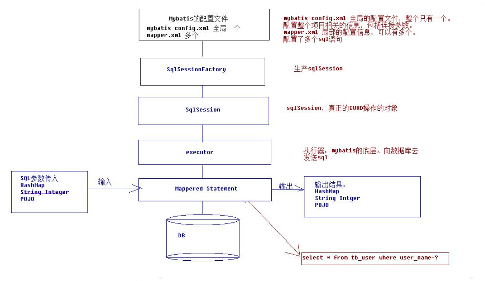

# 动态数据源

## AbstractRoutingDataSource 多数据源切换

在spring中有一个抽象类AbstractRoutingDataSource类，通过这个类可以实现动态数据源切换。AbstractRoutingDataSource 根据用户定义的规则选择当前的数据源，这样我们可以在执行查询之前，设置使用的数据源。实现可动态路由的数据源，在每次数据库查询操作前执行。它的抽象方法 `determineTargetDataSource()` 决定使用哪个数据源。

如下是这个类的成员变量：

```java
private Map<Object, Object> targetDataSources;
private Object defaultTargetDataSource;
private Map<Object, DataSource> resolvedDataSources;
```

- targetDataSources保存了key和数据库连接的映射关系
- defaultTargetDataSource标识默认的连接
- resolvedDataSources这个数据结构是通过targetDataSources构建而来，存储结构也是数据库标识和数据源的映射关系


AbstractRoutingDataSource 中决定获取哪个数据源的方法就是 `determineTargetDataSource`

```java
@Override
public Connection getConnection() throws SQLException {
    return determineTargetDataSource().getConnection();
}

protected DataSource determineTargetDataSource() {
		Assert.notNull(this.resolvedDataSources, "DataSource router not initialized");
		Object lookupKey = determineCurrentLookupKey();
		DataSource dataSource = this.resolvedDataSources.get(lookupKey);
		if (dataSource == null && (this.lenientFallback || lookupKey == null)) {
			dataSource = this.resolvedDefaultDataSource;
		}
		if (dataSource == null) {
			throw new IllegalStateException("Cannot determine target DataSource for lookup key [" + lookupKey + "]");
		}
		return dataSource;
	}
```

该方法又通过 `determineCurrentLookupKey` 方法获取查询数据源的key

所以如果我们需要动态切换数据源，就可以通过以下两种方式定制：

1.  重写 determineCurrentLookupKey 方法

```shell
通过重写 determineCurrentLookupKey 方法，从一个自定义的 DynamicDataSourceContextHolder.getDataSourceKey() 获取数据源key值，这样在我们想动态切换数据源的时候，只要通过 DynamicDataSourceContextHolder.setDataSourceKey(key) 的方式就可以动态改变数据源了。

这种方式要求在获取数据源之前，要先初始化各个数据源到 DynamicDataSource 中。
```

2. 可以通过重写 determineTargetDataSource 方法

```shell
因为数据源就是在这个方法创建并返回的，所以这种方式就比较自由了，支持到任何你希望的地方读取数据源信息，只要最终返回一个 DataSource 的实现类即可。比如你可以到数据库、本地文件、网络接口等方式读取到数据源信息然后返回相应的数据源对象就可以了。
```

### 方式一实现逻辑：

1. 定义DynamicDataSource类继承抽象类AbstractRoutingDataSource，并实现了`determineCurrentLookupKey()`方法。
2. 把配置的多个数据源会放在AbstractRoutingDataSource的 targetDataSources和defaultTargetDataSource中，然后通过`afterPropertiesSet()`方法将数据源分别进行复制到resolvedDataSources和resolvedDefaultDataSource中。

注意afterPropertiesSet源码：

```java
@Override
public void afterPropertiesSet() {
	if (this.targetDataSources == null) {
		throw new IllegalArgumentException("Property 'targetDataSources' is required");
	}
    //初始化resolvedDataSources 
	this.resolvedDataSources = new HashMap<Object, DataSource> (this.targetDataSources.size()); 
    //循环targetDataSources，并添加到resolvedDataSources中
	for (Map.Entry<Object, Object> entry : this.targetDataSources.entrySet()) {
		Object lookupKey = resolveSpecifiedLookupKey(entry.getKey());
		DataSource dataSource = resolveSpecifiedDataSource(entry.getValue());
		this.resolvedDataSources.put(lookupKey, dataSource);
	}
    //如果默认数据源不为空则指定对应数据源
	if (this.defaultTargetDataSource != null) {
		this.resolvedDefaultDataSource = resolveSpecifiedDataSource(this.defaultTargetDataSource);
	}
}
```

#### 具体实现

启动类排除默认的DataSource配置

```java
@SpringBootApplication(exclude = {DataSourceAutoConfiguration.class})
```

自定义数据源

```java
public class DynamicDataSource extends AbstractRoutingDataSource {

    private static volatile DynamicDataSource instance;
    private static final byte[] lock = new byte[0];
    private Map<Object, Object> targetDataSources;

    public static synchronized DynamicDataSource getInstance() {
        if (instance == null) {
            synchronized (lock) {
                if (instance == null) {
                    instance = new DynamicDataSource();
                }
            }
        }
        return instance;
    }

    @Override
    protected Object determineCurrentLookupKey() {
        return DataSourceContextHolder.getDB();
    }

    public Map<Object, Object> getTargetDataSource() {
        return targetDataSources;
    }

    @Override
    public void setTargetDataSources(Map<Object, Object> targetDataSources) {
        this.targetDataSources = targetDataSources;
        super.setTargetDataSources(targetDataSources);
        //注意调用afterPropertiesSet()
        this.afterPropertiesSet();
    }
}
```

初始化多数据源

```sql
@Slf4j
@Configuration
@ConditionalOnBean(DynamicDataSourceConfiguration.class)
public class DynamicDataSourceInit implements ApplicationListener<ApplicationStartedEvent> {

    @Autowired
    TenantService tenantService;

    @Override
    public void onApplicationEvent(ApplicationStartedEvent applicationStartedEvent) {
        initDataSource();
    }

    public void initDataSource() {
        DynamicDataSource dynamicDataSource = DynamicDataSource.getInstance();
        List<Tenant> list = tenantService.listAll();
        //返回可以连接的数据库
        List<Tenant> connectSuccessTenants = DynamicDatabaseUtils.connectDatabase(list);
        //将可以连接的数据库加到DataSource中
        Map<Object, Object> newMap = DynamicDatabaseUtils.addNewDataSource(connectSuccessTenants);
        log.debug("init datasources:{}", newMap.keySet().toString());
        dynamicDataSource.setTargetDataSources(newMap);
    }

    public void initTenantDataSource(Tenant tenant) {
        DynamicDataSource dynamicDataSource = DynamicDataSource.getInstance();
        //返回可以连接的数据库
        tenant = DynamicDatabaseUtils.connectTenantDatabase(tenant);
        if (tenant == null) {
            return;
        }
        //将可以连接的数据库加到DataSource中
        DataSource dataSource = DynamicDatabaseUtils.addNewDataSource(tenant);
        Map<Object, Object> dataSourceMap = dynamicDataSource.getTargetDataSource();
        dataSourceMap.put(tenant.getDbName(), dataSource);
        
        dynamicDataSource.setTargetDataSources(dataSourceMap);
    }
}
```

配置类

```java
@Configuration
@ConditionalOnBean(FlywayConfig.class)
public class DynamicDataSourceConfiguration {

    @Autowired
    private MybatisPlusInterceptor mybatisPlusInterceptor;

    @Bean
    @ConfigurationProperties(prefix = "spring.datasource")
    @RefreshScope
    public DataSource mesDataSource() {
        return DataSourceBuilder.create().type(HikariDataSource.class).build();
    }


    /**
     * 动态数据源: 通过AOP在不同数据源之间动态切换
     *
     * @return
     */
    @Bean
    public DataSource dataSource() {

        DynamicDataSource dataSource = DynamicDataSource.getInstance();

        dataSource.setDefaultTargetDataSource(mesDataSource());
        // 配置多数据源, setTargetDataSources 应该不生效，map会在后面被initFactoryDataSource()覆盖
        Map<Object, Object> dsMap = new HashMap<>();
        dsMap.put("meta", mesDataSource());

        dataSource.setTargetDataSources(dsMap);

        return dataSource;
    }


    /**
     * 事务管理器
     *
     * @return
     */
    @Bean
    public PlatformTransactionManager txManager() {
        return new DataSourceTransactionManager(dataSource());
    }


    @Bean("sqlSessionFactory")
    public MybatisSqlSessionFactoryBean sqlSessionFactory() throws Exception {
        MybatisSqlSessionFactoryBean sqlSessionFactory = new MybatisSqlSessionFactoryBean();
        sqlSessionFactory.setDataSource(dataSource());

        sqlSessionFactory.setMapperLocations(new PathMatchingResourcePatternResolver().getResources("classpath:/mapper/*Mapper.xml"));

        Interceptor[] intercepts = {mybatisPlusInterceptor};
        sqlSessionFactory.setPlugins(intercepts);

        MybatisConfiguration configuration = new MybatisConfiguration();
        configuration.setJdbcTypeForNull(JdbcType.NULL);
        configuration.setMapUnderscoreToCamelCase(true);
        configuration.setCacheEnabled(false);
        sqlSessionFactory.setConfiguration(configuration);

        return sqlSessionFactory;
    }
}
```

工具类

```java
@Component
public class DynamicDatabaseUtils {

    private static final Logger log = org.slf4j.LoggerFactory.getLogger(DynamicDatabaseUtils.class);
    private static String mysqlDriver;

    /**
     * 连接数据库
     *
     * @param tenantList
     */
    public static List<Tenant> connectDatabase(List<Tenant> tenantList) {
        List<Tenant> tenants = new ArrayList<>();
        for (Tenant tenant : tenantList) {
            tenant = connectTenantDatabase(tenant);
            if (tenant != null) {
                tenants.add(tenant);
            }
        }
        return tenants;
    }

    /**
     * 连接数据库
     *
     * @param tenant
     */
    public static Tenant connectTenantDatabase(Tenant tenant) {
        Connection conn = null;
        if (StringUtils.isEmpty(tenant.getDbUrl())) {
            return null;
        }
        if (StringUtils.isEmpty(tenant.getDbName())) {
            return null;
        }
        if (StringUtils.isEmpty(tenant.getDbPassword())) {
            return null;
        }
        if (StringUtils.isEmpty(tenant.getDbName())) {
            return null;
        }
        try {
            String dbUrl = tenant.getDbUrl();
            String urlAndDb = dbUrl.substring(0, dbUrl.indexOf("?") + 1);
            String jdbcUrl = dbUrl.substring(0, urlAndDb.lastIndexOf("/") + 1);
            String suffix = dbUrl.substring(dbUrl.indexOf("?"));
            conn = DriverManager.getConnection(jdbcUrl + tenant.getDbName() + suffix, tenant.getDbUser(), Base64Util.decodeBase642Str(tenant.getDbPassword()));
            log.debug("connectDatabase: --tenantId:" + tenant.getTenantId() + " dbName:" + tenant.getDbName());
            return tenant;
        } catch (SQLException e) {
            log.error("connectDatabase:数据库不存在 --tenantId:" + tenant.getTenantId() + " dbName:" + tenant.getDbName());
        } finally {
            try {
                if (conn != null) {
                    conn.close();
                }
            } catch (Exception e2) {

            }
        }
        return null;
    }


    /**
     * 添加新的数据源
     *
     * @param tenantList
     * @return
     */
    public static Map<Object, Object> addNewDataSource(List<Tenant> tenantList) {
        Map<Object, Object> newMap = new HashMap<>();

        for (Tenant tenant : tenantList) {
            if (!newMap.containsKey(tenant.getTenantCode())) {
                DataSource dataSource = addNewDataSource(tenant);
                newMap.put(tenant.getDbName(), dataSource);
            }
        }
        return newMap;
    }

    /**
     * 添加新的数据源
     *
     * @param tenant
     * @return
     */
    public static DataSource addNewDataSource(Tenant tenant) {
        HikariDataSource dataSource = new HikariDataSource();
        dataSource.setDriverClassName(mysqlDriver);
        dataSource.setUsername(tenant.getDbUser());
        dataSource.setPassword(Base64Util.decodeBase642Str(tenant.getDbPassword()));

        String dbUrl = tenant.getDbUrl();
        String urlAndDb = dbUrl.substring(0, dbUrl.indexOf("?") + 1);
        String jdbcUrl = dbUrl.substring(0, urlAndDb.lastIndexOf("/") + 1);
        String suffix = dbUrl.substring(dbUrl.indexOf("?"));
        dataSource.setJdbcUrl(jdbcUrl + tenant.getDbName() + suffix);

        return dataSource;
    }

    @Value("${spring.datasource.driverClassName}")
    public void setMysqlDriver(String mysqlDriver) {
        DynamicDatabaseUtils.mysqlDriver = mysqlDriver;
    }

}
```

保存线程数据源

```java
/**
 * 保存当前线程使用的数据源名
 */
public class DataSourceContextHolder {

    private static final ThreadLocal<String> contextHolder = new ThreadLocal<>();

    // 获取数据源名
    public static String getDB() {
        return (contextHolder.get());
    }

    // 设置数据源名
    public static void setDB(String dbType) {
        contextHolder.set(dbType);
    }

    // 清除数据源名
    public static void clearDB() {
        contextHolder.remove();
    }
}
```

在任何想要动态切换数据源的时候，只要调用 DataSourceContextHolder.setDataSourceKey(key) 就可以了。

切面

```java
@Order(2)
@Aspect
@Component
@ConditionalOnProperty(value = "service.dynamicDatasource", havingValue = "true")
public class RequestHeadAspect {

    private static final Logger log = org.slf4j.LoggerFactory.getLogger(RequestHeadAspect.class);
    @Autowired
    private DynamicDataSourceInit initDataSources;

    @Autowired
    private TenantService tenantService;

    @Pointcut("execution(* com.irootech..controller..*.*(..))")
    public void controllerMethod() {
    }

    @Pointcut("execution(* com.irootech..service..*.*(..))")
    public void serviceMethod() {
    }

    @Before("controllerMethod()")
    public void beforeControllerMethod(JoinPoint joinPoint) throws InvocationTargetException, IllegalAccessException {

        //跳过tenant包的类
        if (joinPoint.getSignature().getDeclaringTypeName().contains("tenant")) {
            log.debug("controller-------------------tenant");
            return;
        }

        // 接收到请求，记录请求内容
        ServletRequestAttributes attributes = (ServletRequestAttributes) RequestContextHolder.getRequestAttributes();
        HttpServletRequest request = attributes.getRequest();

        String currentUserId = StringUtils.isNotBlank(request.getHeader("userId")) ? request.getHeader("userId") : request.getParameter("userId");
        String currentUserName = StringUtils.isNotBlank(request.getHeader("userName")) ? request.getHeader("userName") : request.getParameter("userName");

        SessionBean.setUserId(currentUserId);
        SessionBean.setUserName(currentUserName);

        String tenantId = request.getParameter("tenantId");
        if (StringUtils.isEmpty(tenantId)) {
            tenantId = request.getHeader("tenantId");
        }

        if (StringUtils.isBlank(tenantId)) {
            //获取tenantId
            if (joinPoint.getArgs() != null && joinPoint.getArgs().length > 0) {
                //遍历参数
                out:
                for (Object arg : joinPoint.getArgs()) {
                    if (arg != null) {
                        Method[] methods = arg.getClass().getMethods();
                        for (Method method : methods) {
                            if (method.getName().equals("getTenantId")) {
                                Object obj = method.invoke(arg);
                                if (obj != null) {
                                    tenantId = obj.toString();
                                }
                                if (StringUtils.isNotBlank(tenantId)) {
                                    break out;
                                }
                            }
                        }
                    }
                }
            }
        }

        log.debug("controller-------------------tenantId,{}", tenantId);
        SessionBean.setTenantId(tenantId);
    }


    @Before("serviceMethod()")
    public void beforeMesServiceMethod(JoinPoint point) {
        beforeServiceMethod(point);
    }

    private void beforeServiceMethod(JoinPoint point) {
        if (point.getSignature().getDeclaringTypeName().contains("tenant")) {
            DataSourceContextHolder.setDB("meta");
            log.debug("service-------------------tenant");
            return;
        }

        String dataSource = "meta";
        if (StringUtils.isNotBlank(SessionBean.getTenantId())) {
            Tenant tenant = tenantService.selectById(SessionBean.getTenantId());
            if (tenant == null) {
                throw new SysException(MdmResultCode.ERROR_TENANT_ID);
            }
            log.debug("service-------------------SessionBean.tenantId：{}", SessionBean.getTenantId());
            dataSource = tenant.getDbName();

            Map<Object, Object> targetDataSources = DynamicDataSource.getInstance().getTargetDataSource();
            if (!targetDataSources.containsKey(dataSource)) {
                initDataSources.initTenantDataSource(tenant);
                targetDataSources = DynamicDataSource.getInstance().getTargetDataSource();
                if (!targetDataSources.containsKey(dataSource)) {
                    log.debug("targetDataSources：{}", targetDataSources.keySet().toString());
                    throw new SysException(MdmResultCode.ERROR_TENANT_ID);
                }
            }
        }

        // 切换数据源
        DataSourceContextHolder.setDB(dataSource);
    }

    @After("controllerMethod()")
    public void afterControllerMethod(JoinPoint point) {
        DataSourceContextHolder.clearDB();
        SessionBean.clear();
    }
}
```


## 回顾数据库连接

### JDBC

```java
public static void main(String[] args) throws Exception {
        Connection connection = null;
        PreparedStatement preparedStatement = null;
        ResultSet resultSet = null;
        try {
            // 加载驱动
            Class.forName("com.mysql.jdbc.Driver");
 
            // 创建数据库连接
            String url = "jdbc:mysql://127.0.0.1:3306/mybatis";
            String user = "root";
            String password = "123456";
            connection = DriverManager.getConnection(url, user, password);
 
            // 获取statement对象
            String sql = "SELECT * FROM tb_user WHERE id = ?";
            preparedStatement = connection.prepareStatement(sql);
 
            // 设置参数,有2个参数，第一个是下标，从1开始，第二个是参数值
            preparedStatement.setLong(1, 1L);
 
            // 执行查询
            resultSet = preparedStatement.executeQuery();
 
            // 遍历结果集
            while (resultSet.next()) {
                System.out.println("id = " + resultSet.getLong("id"));
                System.out.println("name = " + resultSet.getString("name"));
                System.out.println("passwd = " + resultSet.getString("password"));
            }
        } finally {
            // 关闭连接释放资源
            if (null != resultSet) {
                resultSet.close();
            }
            if (null != preparedStatement) {
                preparedStatement.close();
            }
            if (null != connection) {
                connection.close();
            }
        }
    }
```

### Mybatis

