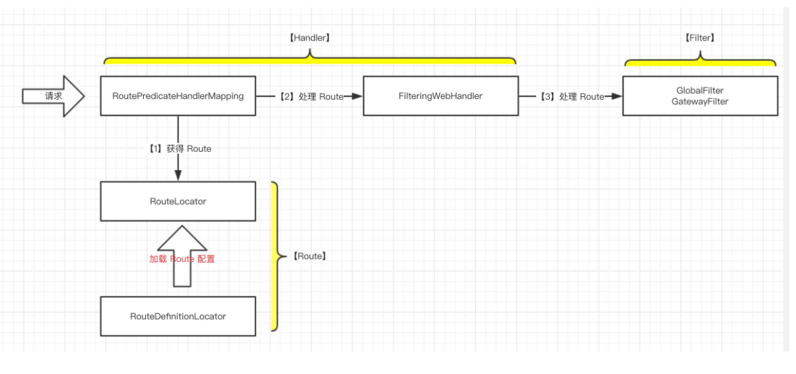

# Spring Cloud Gateway

## 整合Nacos

引入nacos jar 包

```sql
compile ('com.alibaba.cloud:spring-cloud-starter-alibaba-nacos-discovery:2.2.1.RELEASE')
```

```yaml
server:
  port: 8087
spring:
  application:
    name: nacos_gateway
  cloud:
    nacos:
      discovery:
        server-addr: 127.0.0.1:8848
    gateway:
      discovery:
        locator:
          enabled: true  #表明gateway开启服务注册和发现的功能，并且spring cloud gateway自动根据服务发现为每一个服务创建了一个router，这个router将以服务名开头的请求路径转发到对应的服务
          lower-case-service-id: true  #是将请求路径上的服务名配置为小写（因为服务注册的时候，向注册中心注册时将服务名转成大写的了
      routes: #自定义规则
          -id: apiuser
          #
          uri: lb://nacos-consumer-user
          predicates:
          # http://localhost:6601/user/user/users/2, 必须加上StripPrefix=1，否则访问服务时会带上user
          - Path=/user/** # 转发该路径
           #以下是配置例子
            # - id: 163                     #网关路由到网易官网
            #  uri: http://www.163.com/
            #  predicates:
                - Path=/163/**
        #      - id: ORDER-SERVICE           #网关路由到订单服务order-service
        #        uri: lb://ORDER-SERVICE
        #        predicates:
        #          - Path=/ORDER-SERVICE/**
        #      - id: USER-SERVICE            #网关路由到用户服务user-service
        #        uri: lb://USER-SERVICE
        #        predicates:
        #          - Pach=/USER-SERVICE/**
```

### 支持Nacos权重

```java
@Bean
public IRule loadBalanceRule(){
    return new NacosRule();
}
```


## Filter执行顺序

转载自：https://segmentfault.com/a/1190000018947083?utm_source=tag-newest

- SCG采用的是Global Filter和Route Filter相结合的方式

SCG所谓Route Filter就是像下面这样的：

```
spring:
  cloud:
    gateway:
      routes:
        - id: tomcat_route
          uri: http://tomcat:8080
          predicates:
            - Path=/tomcat/docs
          filters:
            - StripPrefix=1
            - RemoveRequestHeader=X-Request-Foo
```

上面的`StripPrefix`和`RemoveRequestHeader`就是Route Filter，而SCG的Global Filter则是隐式的，无需显式配置，它们会在请求过来的时候被SCG调用。

也就是说你可以配置不同的Route，然后为每个Route配置不同的Route Filter，这一切都是在配置阶段就决定下来的。

### Filter的角色

- 在SCG概念中只有一种Filter（撇开Global和Route的区别），它用代码来区分Pre Filter、Post Filter。在文档中还提到了Routing Filter，其实也是Pre Filter。

- Filter在**“pre”类型的过滤器可以做参数校验、权限校验、流量监控、日志输出、协议转换**等，

  在**“post”类型的过滤器中可以做响应内容、响应头的修改，日志的输出，流量监控**等有着非常重要的作用。

### Filter的排序

前面讲了，SCG在执行过程中Global Filter和Route Filter是一起执行的，那么它们的order是怎样的？

先来看看Global Filter，你可以访问`/actuator/gateway/globalfilters`（见[文档](https://cloud.spring.io/spring-cloud-static/spring-cloud-gateway/2.1.1.RELEASE/single/spring-cloud-gateway.html#_global_filters_2)）得到Global Filter的排序：


那么如果你写了一个自定义 Global Filter，那么它的order是什么呢？这个要看情况：

- 如果你的自定义Global Filter实现了`Ordered`接口或者写了`@Order`注解，那么它的order就是它自己设定的值
- 否则，它就没有order

关于这点可以看[FilteringWebHandler.java的源代码](https://github.com/spring-cloud/spring-cloud-gateway/blob/v2.1.1.RELEASE/spring-cloud-gateway-core/src/main/java/org/springframework/cloud/gateway/handler/FilteringWebHandler.java#L58-L67)。

再来看看Route Filter，这也分两种情况：

- 如果RouteFilter实现了`Ordered`接口或者写了`@Order`注解，那么它的order就是它自己设定的值。
- 否则，它的order则是从1开始，按照Route中定义的顺序依次排序。

关于这点可以看[RouteDefinitionRouteLocator.java的源代码](https://github.com/spring-cloud/spring-cloud-gateway/blob/v2.1.1.RELEASE/spring-cloud-gateway-core/src/main/java/org/springframework/cloud/gateway/route/RouteDefinitionRouteLocator.java#L183-L192)。

最后SCG把它们两个结合起来，做一个排序，对于没有order的Filter，它的order则默认为`Ordered.LOWEST_PRECEDENCE`。关于这点可以看[FilteringWebHandler.java的源代码](https://github.com/spring-cloud/spring-cloud-gateway/blob/v2.1.1.RELEASE/spring-cloud-gateway-core/src/main/java/org/springframework/cloud/gateway/handler/FilteringWebHandler.java#L75-L82)。

用一张图做总结：


SCG调用过程


**Gateway的工作原理：**
客户端请求经过HandlerMapping的处理，先进行路由匹配，如果匹配到路由（Router）就交给网关的web处理程序（Gateway Web Handler）来处理，经过一系列的调用过滤器链（肯定有责任链模式）后转发到被代理的服务执行真正的调用逻辑。

**结合Gateway内部控制说明：**
根据Predicate进行请求路径的匹配。
根据Filter对匹配的请求进行逻辑处理。

这张图大概告诉你了SCG的调用过程，可以看到经过了一堆Filters，但是并没有告诉你Filter的执行顺序。然后在SCG的[6.1 Combined Global Filter and GatewayFilter Ordering](https://cloud.spring.io/spring-cloud-static/spring-cloud-gateway/2.1.1.RELEASE/single/spring-cloud-gateway.html#_combined_global_filter_and_gatewayfilter_ordering)提到了：

> As Spring Cloud Gateway distinguishes between "pre" and "post" phases for filter logic execution (see: How It Works), the filter with the highest precedence will be the first in the "pre"-phase and the last in the "post"-phase.

如果Filter是Pre Filter，那么执行顺序和排序顺序相同，order值越大，越先执行，如果这个Filter是Post Filter则执行顺序和排序顺序相反，order值越小，越先执行。


### 总结

- 执行某个Route的时候，SCG会将Global Filter和Route Filter结合起来并排序：
  - 没有给order的Global Filter则保持order为null去排序
  - 没有给order的Route Filter的order则从1开始，根据Route中定义的顺序给值
  - 排序逻辑见[AnnotationAwareOrderComparator](https://docs.spring.io/spring/docs/5.1.6.RELEASE/javadoc-api/org/springframework/core/annotation/AnnotationAwareOrderComparator.html)
- 对于Pre Filter，执行顺序同排序顺序
- 对于Post Filter，执行顺序与排序顺序相反
- 如果你要自定义Global Filter，那么一般来说：
  - 自定义的Global Pre Filter要在Routing Filter之前执行
  - 自定义的Global Post Filter要在Routing Filter之后执行或者NettyWriteResponseFilter之后执行
- 如果你要自定义Route Filter，那么一般来说：
  - 自定义Route Pre Filter要在`ForwardPathFilter`和`RouteToRequestUrlFilter`之间，而且不需要实现`Ordered`接口或添加`@Order`注解
  - 自定义的Route Post Filter比较少见，放在Routing Filter或者NettyWriteResponseFilter之后执行


## 网关初始化

转载自http://www.iocoder.cn/Spring-Cloud-Gateway/init/

**本文主要基于 Spring-Cloud-Gateway 2.0.X M4**

### 概述

本文主要分享 **Spring Cloud Gateway 启动初始化的过程**。

在初始化的过程中，涉及到的组件会较多，本文不会细说，留到后面每篇文章针对每个组件详细述说。

**那么这有什么意义呢**？先对 Spring Cloud Gateway 内部的组件有**整体**的印象。

在官方提供的实例项目 `spring-cloud-gateway-sample` ，我们看到 GatewaySampleApplication 上有 `@EnableAutoConfiguration` 注解。因为该项目导入了 `spring-cloud-gateway-core` 依赖库，它会扫描 Spring Cloud Gateway 的配置。

在 [`org.springframework.cloud.gateway.config`](https://github.com/YunaiV/spring-cloud-gateway/tree/f552f51fc42db9ed88f783dc5f1291a22b34dcbc/spring-cloud-gateway-core/src/main/java/org/springframework/cloud/gateway/config) 包下，我们可以看到**四个**配置类 ：

- GatewayAutoConfiguration
- GatewayClassPathWarningAutoConfiguration
- GatewayLoadBalancerClientAutoConfiguration
- GatewayRedisAutoConfiguration


### GatewayClassPathWarningAutoConfiguration

Spring Cloud Gateway 2.x 基于 Spring WebFlux 实现。

`org.springframework.cloud.gateway.config.GatewayClassPathWarningAutoConfiguration` ，用于检查项目是否**正确**导入 `spring-boot-starter-webflux` 依赖，而不是错误**导入** `spring-boot-starter-web` 依赖。

点击链接 [链接](https://github.com/YunaiV/spring-cloud-gateway/blob/382a4cd98fbb8ac53a83a5559bacb0f885838074/spring-cloud-gateway-core/src/main/java/org/springframework/cloud/gateway/config/GatewayClassPathWarningAutoConfiguration.java) 查看 GatewayClassPathWarningAutoConfiguration 的代码实现。

### GatewayLoadBalancerClientAutoConfiguration

`org.springframework.cloud.gateway.config.GatewayLoadBalancerClientAutoConfiguration` ，初始化 LoadBalancerClientFilter ，点击 [链接](https://github.com/YunaiV/spring-cloud-gateway/blob/382a4cd98fbb8ac53a83a5559bacb0f885838074/spring-cloud-gateway-core/src/main/java/org/springframework/cloud/gateway/config/GatewayLoadBalancerClientAutoConfiguration.java) 查看代码。

在 [《Spring-Cloud-Gateway 源码解析 —— 过滤器 (4.4) 之 LoadBalancerClientFilter 负载均衡》](http://www.iocoder.cn/Spring-Cloud-Gateway/filter-load-balancer-client/?self) 详细解析 LoadBalancerClientFilter 的代码实现。

### GatewayRedisAutoConfiguration

`org.springframework.cloud.gateway.config.GatewayRedisAutoConfiguration` ，初始化 RedisRateLimiter 。

RequestRateLimiterGatewayFilterFactory 基于 RedisRateLimiter 实现网关的**限流**功能，在 [《Spring-Cloud-Gateway 源码解析 —— 过滤器 (4.10) 之 RequestRateLimiterGatewayFilterFactory 请求限流》](http://www.iocoder.cn/Spring-Cloud-Gateway/filter-request-rate-limiter/?self) 详细解析相关的代码实现。

###  GatewayAutoConfiguration

`org.springframework.cloud.gateway.config.GatewayAutoConfiguration` ，Spring Cloud Gateway **核心**配置类，初始化如下 ：

- Netty**Configuration**
- Global**Filter**
- FilteringWeb**Handler**
- Gateway**Properties**
- PrefixPathGateway**FilterFactory**
- Route**PredicateFactory**
- Route**DefinitionLocator**
- Route**Locator**
- Route**PredicateHandlerMapping**
- GatewayWebflux**Endpoint**

组件关系交互如下图 ：



### RouteDefinitionLocator


- RouteDefinitionLocator负责读取路由配置(org.springframework.cloud.gateway.route.RouteDefinition) 。从上图中我们可以看到，RouteDefinitionLocator接口

  有四种实现 ：

  - **PropertiesRouteDefinitionLocator** ，从**配置文件**( 例如，YML / Properties 等 ) 读取。在 [《Spring-Cloud-Gateway 源码解析 —— 路由（1.2）之 PropertiesRouteDefinitionLocator 配置文件》「2. PropertiesRouteDefinitionLocator」](http://www.iocoder.cn/Spring-Cloud-Gateway/route-definition-locator-properties?self) 详细解析。
  - **RouteDefinitionRepository** ，从**存储器**( 例如，内存 / Redis / MySQL 等 )读取。在 [《Spring-Cloud-Gateway 源码解析 —— 路由（1.3）之 RouteDefinitionRepository 存储器》](http://www.iocoder.cn/Spring-Cloud-Gateway/route-definition-locator-repository/?self) 详细解析。
  - **DiscoveryClientRouteDefinitionLocator** ，从**注册中心**( 例如，Eureka / Consul / Zookeeper / Etcd 等 )读取。在 [《Spring-Cloud-Gateway 源码解析 —— 路由（1.4）之 DiscoveryClientRouteDefinitionLocator 注册中心》](http://www.iocoder.cn/Spring-Cloud-Gateway/route-definition-locator-discover-client/?self) 详细解析。
  - **CompositeRouteDefinitionLocator** ，组合**多种** RouteDefinitionLocator 的实现，为 RouteDefinitionRouteLocator 提供**统一**入口。在 [本文](http://www.iocoder.cn/Spring-Cloud-Gateway/route-definition-locator-intro/#) 详细解析。
  - 另外，**CachingRouteDefinitionLocator** 也是 RouteDefinitionLocator 的实现类，已经被 CachingRouteLocator 取代。

- **RouteLocator** 可以直接**自定义**路由( `org.springframework.cloud.gateway.route.Route` ) ，也可以通过 RouteDefinitionRouteLocator 获取 RouteDefinition ，并转换成 Route 。

- **重要**，对于上层调用者 RoutePredicateHandlerMapping ，使用的是 RouteLocator 和 Route 。而 RouteDefinitionLocator 和 RouteDefinition 用于通过**配置定义路由**。**那么自定义 RouteLocator 呢**？通过**代码定义路由**。


## Gateway 全局统一前缀

转载自https://blog.csdn.net/w1014074794/article/details/109098518

首先根据配置属性spring.cloud.gateway.discovery.locator.enabled定位到GatewayDiscoveryClientAutoConfiguration自动化配置类。

查看源码发现，核心是通过initPredicates和initFilters分别初始化定义了一个Predicate和Filter。
其中定义的PathRoutePredicate主要根据serviceId去进行请求的路径匹配，只有路径规则匹配成功后，才会进入Filter的逻辑处理。initFilters方法中主要是定义了一个RewritePathGatewayFilter，主要是将发到具体服务中的请求的url路径进行重写，去除掉前缀“/serviceId”。

重写定义GatewayDiscoveryClientAutoConfiguration自动化配置类，改写原先的Predicate和Filter，添加统一的请求前缀“/api/v1”。

```java
@Slf4j
@Configuration
public class GatewayDiscoveryClientConfig<main> extends GatewayDiscoveryClientAutoConfiguration {

    @Value("${spring.cloud.gateway.api-prefix:/api/v1}")
    private  String prefix;

    @Bean
    @Override
    public DiscoveryLocatorProperties discoveryLocatorProperties() {
        DiscoveryLocatorProperties properties = new DiscoveryLocatorProperties();
        properties.setPredicates(myInitPredicates());
        properties.setFilters(myInitFilters());
        return properties;
    }

    public  List<PredicateDefinition> myInitPredicates() {
        ArrayList<PredicateDefinition> definitions = new ArrayList();
        PredicateDefinition predicate = new PredicateDefinition();
        //定义路由路径的匹配规则
        predicate.setName(NameUtils.normalizeRoutePredicateName(PathRoutePredicateFactory.class));
        String pattern ="'"+prefix+"/'+serviceId+'/**'";
        predicate.addArg("pattern", pattern);
        definitions.add(predicate);
        return definitions;
    }
    
    public  List<FilterDefinition> myInitFilters() {
        ArrayList<FilterDefinition> definitions = new ArrayList();
        FilterDefinition filter = new FilterDefinition();
        //重新请求路径
        filter.setName(NameUtils.normalizeFilterFactoryName(RewritePathGatewayFilterFactory.class));
        String regex = "'"+prefix+"/' + serviceId + '/(?<remaining>.*)'";
        String replacement = "'/${remaining}'";
        filter.addArg("regexp", regex);
        filter.addArg("replacement", replacement);
        definitions.add(filter);
        return definitions;
    }

}

```

启动类代码，排除gateway 自动化配置类

```java
@SpringBootApplication(exclude = {
        GatewayDiscoveryClientAutoConfiguration.class
})
@EnableDiscoveryClient
@Slf4j
public class WxswjGatewayApplication {
    public static void main(String[] args) {
        SpringApplication.run(WxswjGatewayApplication.class, args);
        log.info("网关服务启动成功！");
    }
}
```

自定义自动化配置

```java
/**
 * @program: wxswj
 * @description: 自定义网关注册中心配置
 * @create: 2020-10-14 20:11
 **/
@Slf4j
@Configuration
public class GatewayDiscoveryClientConfig<main> extends GatewayDiscoveryClientAutoConfiguration {

    @Value("${spring.cloud.gateway.api-prefix:/api/v1}")
    private  String prefix;

    @Bean
    @Override
    public DiscoveryLocatorProperties discoveryLocatorProperties() {
        DiscoveryLocatorProperties properties = new DiscoveryLocatorProperties();
        properties.setPredicates(myInitPredicates());
        properties.setFilters(myInitFilters());
        return properties;
    }

    public  List<PredicateDefinition> myInitPredicates() {
        ArrayList<PredicateDefinition> definitions = new ArrayList();
        PredicateDefinition predicate = new PredicateDefinition();
        //定义路由路径的匹配规则
        predicate.setName(NameUtils.normalizeRoutePredicateName(PathRoutePredicateFactory.class));
        String pattern ="'"+prefix+"/'+serviceId+'/**'";
        predicate.addArg("pattern", pattern);
        definitions.add(predicate);
        return definitions;
    }

    public  List<FilterDefinition> myInitFilters() {
        ArrayList<FilterDefinition> definitions = new ArrayList();
        FilterDefinition filter = new FilterDefinition();
        //重新请求路径
        filter.setName(NameUtils.normalizeFilterFactoryName(RewritePathGatewayFilterFactory.class));
        String regex = "'"+prefix+"/' + serviceId + '/(?<remaining>.*)'";
        String replacement = "'/${remaining}'";
        filter.addArg("regexp", regex);
        filter.addArg("replacement", replacement);
        definitions.add(filter);
        return definitions;
    }
}


```


## Gateway基于nacos 配置实现动态路由

本地yml里配置规则，如果有需要变化，无法及时变更，可以在 在nacos 自定义路由规则，但gateway没有适配nacos，一旦新增路由，gateway无法及时获取到，需要自定义监听器。

工程启动的时候拉取配置中心的配置，初始化路由信息。启动后监听配置中心的配置变化，有变化后则更新工程路由信息。

```java
@Service
@Slf4j
public class DynamicRouteByNacos implements CommandLineRunner {
    @Autowired
    private DynamicRouteUtil dynamicRouteService;

    @Autowired
    private NacosGatewayPropertiesConfig nacosGatewayProperties;

    /**
     * 监听Nacos Server下发的动态路由配置。初始化的时候先加载一次配置
     */
    public void dynamicRouteByNacosListener (){
        try {
            Properties properties = new Properties();
            properties.put(PropertyKeyConst.NAMESPACE, nacosGatewayProperties.getNameSpace());
            properties.put(PropertyKeyConst.SERVER_ADDR, nacosGatewayProperties.getAddress());
            ConfigService configService= NacosFactory.createConfigService(properties);
            String content = configService.getConfig(nacosGatewayProperties.getDataId(), nacosGatewayProperties.getGroupId(), nacosGatewayProperties.getTimeout());

            //初始话的时候也初始化路由
            if(StringUtils.isNotEmpty(content)){
                List<RouteDefinition> list = JSONObject.parseArray(content, RouteDefinition.class);
                list.forEach(definition->{
                    dynamicRouteService.update(definition);
                });
            }

            configService.addListener(nacosGatewayProperties.getDataId(), nacosGatewayProperties.getGroupId(), new Listener()  {
                @Override
                public void receiveConfigInfo(String configInfo) {
                    List<RouteDefinition> list = JSONObject.parseArray(configInfo, RouteDefinition.class);
                    log.warn("---------------------"+ JSON.toJSONString(list));
                    list.forEach(definition->{
                        dynamicRouteService.update(definition);
                    });
                }
                @Override
                public Executor getExecutor() {
                    return null;
                }
            });
        } catch (NacosException e) {
            e.printStackTrace();
        }
    }

    @Override
    public void run(String... args) throws Exception {
        dynamicRouteByNacosListener();

    }
}

```

### 网关中nacos的配置以及配置类

```java
/**
 * Created by Miracle ZhangYunHai on 2020/9/10 14:33
 */
@ConfigurationProperties(prefix="spring.cloud.nacos.route.config", ignoreUnknownFields = true)
@Configuration
@Data
public class NacosGatewayPropertiesConfig {

    /**
     * nacos的访问地址
     */
    private String address;

    /**
     * 配置的dataId
     */
    private String dataId;

    /**
     * 配置的groupId
     */
    private String groupId;

    /**
     * 连接超时时间
     */
    private Long timeout;

    /**
     * 命名空间
     */
    private String nameSpace;

}

```

### 更新路由方法

```java
/**
 * 
 *实现 ApplicationEventPublisherAware push RefreshRoutesEvent 来跟新路由
 */
@Service
@Slf4j
public class DynamicRouteUtil implements ApplicationEventPublisherAware {

    @Autowired
    private RouteDefinitionWriter routeDefinitionWriter;

    private ApplicationEventPublisher publisher;


    /**
     * 增加路由
     * @param definition
     * @return
     */
    public String add(RouteDefinition definition) {
        routeDefinitionWriter.save(Mono.just(definition)).subscribe();
        this.publisher.publishEvent(new RefreshRoutesEvent(this));
        return "success";
    }


    /**
     * 更新路由
     * @param definition
     * @return
     */
    public String update(RouteDefinition definition) {
        try {
            this.routeDefinitionWriter.delete(Mono.just(definition.getId()));
        } catch (Exception e) {
            return "update fail,not find route  routeId: "+definition.getId();
        }
        try {
            routeDefinitionWriter.save(Mono.just(definition)).subscribe();
            this.publisher.publishEvent(new RefreshRoutesEvent(this));
            return "success";
        } catch (Exception e) {
            return "update route  fail";
        }


    }
    /**
     * 删除路由
     * @param id
     * @return
     */
    public String delete(String id) {
        try {
            this.routeDefinitionWriter.delete(Mono.just(id));
            return "delete success";
        } catch (Exception e) {
            e.printStackTrace();
            return "delete fail";
        }

    }

    @Override
    public void setApplicationEventPublisher(ApplicationEventPublisher applicationEventPublisher) {
        this.publisher = applicationEventPublisher;
    }
}
```

