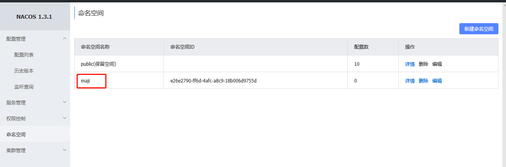
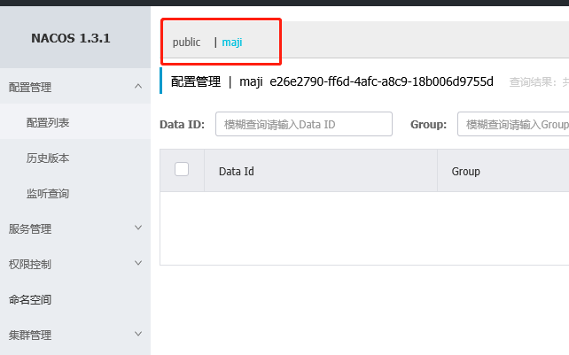
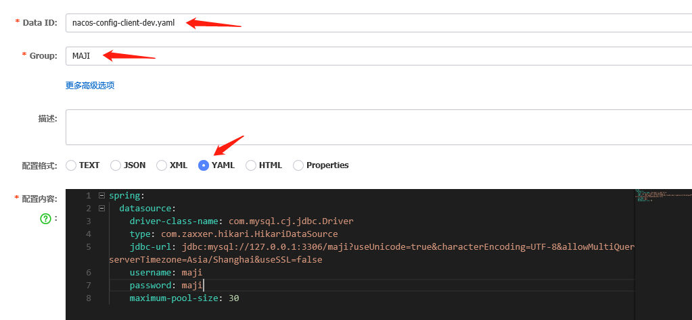

#  Nacos

## Nacos 用作注册中心

```groovy
compile ('com.alibaba.cloud:spring-cloud-starter-alibaba-nacos-discovery:2.2.1.RELEASE')
```

配置文件

```groovy
spring:
  application:
    name: nacos-discovery-client 
  cloud:
    nacos:
      discovery:
        server-addr: 127.0.0.1:8848 // Nacos服务接口(不能加http前缀)，直接访问 localhost:8848/nacos 可以进入管理页面
```

## Nacos 用作配置中心

Nacos支持“Namespace+group+data ID”的配置解决方案

```groovy
compile ('com.alibaba.cloud:spring-cloud-starter-alibaba-nacos-config:2.2.1.RELEASE')
```

必须使用`bootstrap.yaml`，因为`bootstrap.yaml`加载顺序优先于`application.yaml`，会默认去nacos查找 `项目名.yml` 的配置文件。

```yaml
spring:
  application:
    name: nacos-config-client
  cloud:
    nacos:
      config:
        server-addr: 127.0.0.1:8848 #nacos地址
        file-extension: yaml #nacos上文件的后缀，默认是properties
        group: MAJI #分组，不配默认为 DEFAULT_GROUP
        namespace: e26e2790-ff6d-4afc-a8c9-18b006d9755d #命名空间ID，可不配，有默认
        # 以上默认会去找 namespace 下 group 中的 ${spring.application.name}-${spring.profiles.active}.${file-extension} 文件
  profiles:
    active: dev #环境
server:
  port: 8055
```

### Nacos 有三种配置加载方案

#### Namespace 

命名空间，类似于租户

1、先创建命名空间



2、回到配置列表中，能够看到所创建的三个命名空间



#### Group

可以理解为项目，默认是DEFAULT_GROUP，创建时可以自定义



#### profile

每个项目会有多个模块，每个模块存有不同环境的配置。

创建时Data Id 命名规范为：`${spring.application.name}-${spring.profiles.active}.${file-extension}`

如果没有`spring.profiles.active`，则会去找 `${spring.application.name}.${file-extension}`文件。

### @RefreshScope

类加上该注解，nacos更改配置，可以实时刷新到，实现配置自动更新。